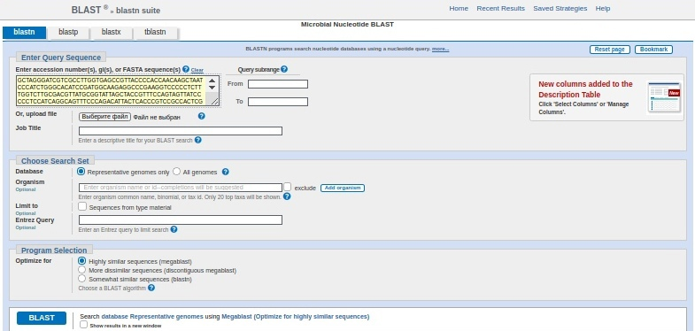

# E.coli outbreak: labjournal

## 1. Exploring the dataset

For this project, we provide three libraries from the TY2482 sample with the following insert sizes and orientation:

###  SRR292678 - paired end, insert size 470 bp (forward reads, reverse reads, 400 Mb each)
1) Forward reads
```bash
wget https://d28rh4a8wq0iu5.cloudfront.net/bioinfo/SRR292678sub_S1_L001_R1_001.fastq.gz
gunzip SRR292678sub_S1_L001_R1_001.fastq.gz
```
2) Reverse reads
```bash    
wget https://d28rh4a8wq0iu5.cloudfront.net/bioinfo/SRR292678sub_S1_L001_R2_001.fastq.gz
gunzip SRR292678sub_S1_L001_R2_001.fastq.gz
```

### SRR292862 – mate pair, insert size 2 kb, (forward reads, reverse reads, 200 Mb each)
1) Forward reads
```bash    
wget https://d28rh4a8wq0iu5.cloudfront.net/bioinfo/SRR292862_S2_L001_R1_001.fastq.gz
gunzip SRR292678sub_S2_L001_R1_001.fastq.gz
``` 
2) Reverse reads
```bash    
wget https://d28rh4a8wq0iu5.cloudfront.net/bioinfo/SRR292862_S2_L001_R2_001.fastq.gz
gunzip SRR292678sub_S2_L001_R2_001.fastq.gz
```

### SRR292770 – mate pair, insert size 6 kb, (forward reads, reverse reads, 200 Mb each)
1) Forward reads
```bash    
wget https://d28rh4a8wq0iu5.cloudfront.net/bioinfo/SRR292770_S1_L001_R1_001.fastq.gz
gunzip SRR292770_S1_L001_R1_001.fastq.gz
``` 
2) Reverse reads
```bash    
wget https://d28rh4a8wq0iu5.cloudfront.net/bioinfo/SRR292770_S1_L001_R2_001.fastq.gz
gunzip SRR292770_S1_L001_R2_001.fastq.gz
```

### FastQC reports

```bash     
fastqc -o . SRR292678sub_S1_L001_R1_001.fastq SRR292678sub_S1_L001_R2_001.fastq SRR292862_S2_L001_R1_001.fastq SRR292862_S2_L001_R2_001.fastq SRR292770_S1_L001_R1_001.fastq SRR292770_S1_L001_R2_001.fastq
```
#### Number of reads:

1) SRR292678 - paired end, insert size 470 bp
Forward reads: 5499346
Reverse reads: 5499346

2) SRR292862 – mate pair, insert size 2 kb
Forward reads: 5102041
Reverse reads: 5102041

3) SRR292770 – mate pair, insert size 6 kb
Forward reads: 5102041
Reverse reads: 5102041

You can find more information in the directory ./fastqc_reports

## 2. K-mer profile and genome size estimation
To count kmers, we will use the Jellyfish

### 2.1. Installing Jellyfish

```bash     
sudo apt-get install jellyfish
```

### 2.2. Counting k-mers

The “jellyfish count” command takes the following options:

-m or “mer” specifies the length <br>
-C tells it to ignore directionality (it treats each read the same as its reverse complement).<br>
-s is an initial estimate for the size of the hash table jellyfish uses, set > genome size<br>
-o specifies the name of the output file. choose a name with the k-mer length in it.

1) Running "jellyfish count" command
```bash
jellyfish count -m 31 -C -s 5499346 -o kmer SRR292678sub_S1_L001_R1_001.fastq
```

2) Creating the histogram file
```bash
jellyfish histo kmer > kmerhist.txt
```

### 2.3. Visualizing k-mer distribution
I created the script ./scripts/k-mer.py to visualize k-mer distribution

#### k-mer distribution


#### The border of the initial peak corresponding to sequence errors at 5


### 2.4. 2.4. Estimate the genome size
To estimate the genome size I modified k-mer.py
The answer is 5199855

## 3. Assembling E. coli X genome from paired reads

We will use assembler SPAdes.

### 3.1. Dowloading and unpacking SPAdes

```bash
wget https://cab.spbu.ru/files/release3.15.2/SPAdes-3.15.2-Linux.tar.gz
gunzip SPAdes-3.15.2-Linux.tar.gz
tar -xvf SPAdes-3.15.2-Linux.tar
```

Testing:
```bash
spades.py --test
```
### 3.2. Assembling genome from the library SRR292678

```bash
spades.py --pe1-1 SRR292678sub_S1_L001_R1_001.fastq --pe1-2 SRR292678sub_S1_L001_R2_001.fastq -o SRR292678
```

### 3.3. Quality of the resulting assembly

We use QUAST online tool on scaffolds.fasta and contigs.fasta

#### report for contigs.fasta:


#### report for scaffolds.fasta:


### 3.4. Effect of read correction

Using jellyfish on corrected files:

```bash
jellyfish count -m 31 -C -s 5499346 -o kmercorrected SRR292678/corrected/SRR292678sub_S1_L001_R1_001.00.0_0.cor.fastq
```

Creating the histogram file

```bash
jellyfish histo kmercorrected > kmercorrectedhist.txt
```

#### Then I made the plot using ./scripts/k-mer.py


There are fewer low frequent reads in corrected reads, which are related to sequencing errors.

## 4. Impact of reads with large insert size

### 4.1. Running SPAdes
Now we run SPAdes by consolidating three libraries. We use all three libraries: SRR292678 as a paired ends, SRR292862 and SRR292770 as a mate pairs.

```bash
spades.py --pe1-1 SRR292678sub_S1_L001_R1_001.fastq --pe1-2 SRR292678sub_S1_L001_R2_001.fastq --mp1-1 SRR292862_S2_L001_R1_001.fastq --mp1-2 SRR292862_S2_L001_R2_001.fastq --mp2-1 SRR292770_S1_L001_R1_001.fastq --mp2-2 SRR292770_S1_L001_R2_001.fastq -o assembly2
```
We use QUAST online tool on scaffolds.fasta and contigs.fasta

#### report for contigs.fasta:


#### report for scaffolds.fasta:


N50 becomes higher, it happened through the use of mate pairs, which increases assembly accuracy solving repeats.

## 5. Genome Annotation

### 5.1. Installing Prokka:
```bash
sudo apt install prokka
```

### 5.2. Running Prokka:
```bash
prokka scaffolds.fasta --centre X --compliant
```

## 6. Finding the closest relative of E. coli X

6.1. Locate 16S rRNA in the assembled E. coli X genome
Installing barrnap:
```bash
sudo apt install barrnap
```

Running barrnap to find the location of ribosomal RNA genes:
```bash
barrnap scaffolds.fasta > ribosomal_rna_search
```

Looking at result:
```bash
cat ribosomal_rna_search
```

The output:

##gff-version 3
NODE_1_length_2259538_cov_74.933419     barrnap:0.9     rRNA    287925  288026      4.9e-10 -       .       Name=5S_rRNA;product=5S ribosomal RNA
NODE_1_length_2259538_cov_74.933419     barrnap:0.9     rRNA    291457  292994      0       -       .       Name=16S_rRNA;product=16S ribosomal RNA
NODE_1_length_2259538_cov_74.933419     barrnap:0.9     rRNA    329502  329603      4.9e-10 -       .       Name=5S_rRNA;product=5S ribosomal RNA
NODE_1_length_2259538_cov_74.933419     barrnap:0.9     rRNA    333038  334575      0       -       .       Name=16S_rRNA;product=16S ribosomal RNA
NODE_1_length_2259538_cov_74.933419     barrnap:0.9     rRNA    906257  907794      0       -       .       Name=16S_rRNA;product=16S ribosomal RNA
NODE_277_length_223_cov_0.720238        barrnap:0.9     rRNA    19      1295.6e-18  +       .       Name=5S_rRNA;product=5S ribosomal RNA
NODE_2_length_1046849_cov_73.627364     barrnap:0.9     rRNA    641223  641333      2.2e-11 -       .       Name=5S_rRNA;product=5S ribosomal RNA
NODE_2_length_1046849_cov_73.627364     barrnap:0.9     rRNA    644690  646227      0       -       .       Name=16S_rRNA;product=16S ribosomal RNA
NODE_3_length_758235_cov_76.309674      barrnap:0.9     rRNA    353665  355202      0       +       .       Name=16S_rRNA;product=16S ribosomal RNA
NODE_3_length_758235_cov_76.309674      barrnap:0.9     rRNA    358559  358669      2.2e-11 +       .       Name=5S_rRNA;product=5S ribosomal RNA
NODE_4_length_307209_cov_78.386269      barrnap:0.9     rRNA    84700   84801       4.9e-10 -       .       Name=5S_rRNA;product=5S ribosomal RNA
NODE_4_length_307209_cov_78.386269      barrnap:0.9     rRNA    88324   89861       0       -       .       Name=16S_rRNA;product=16S ribosomal RNA
NODE_4_length_307209_cov_78.386269      barrnap:0.9     rRNA    185633  187170      0       -       .       Name=16S_rRNA;product=16S ribosomal RNA
NODE_82_length_720_cov_1.094737 barrnap:0.9     rRNA    314     719     9.8e-23     +       .       Name=16S_rRNA;product=16S ribosomal RNA (partial);note=aligned only 25 percent of the 16S ribosomal RNA

We can find the 16S rRNA in scaffolds [291457:292994], [333038:333038], [906257:907794], for example. I wrote the script ./scripts/find_16S.py to get the sequence.

### 6.2. Using BLAST to search for the genome in the RefSeq database

#### Running BLAST (http://blast.ncbi.nlm.nih.gov/):



As a result we have the best match with NC_011748.1 Escherichia coli 55989, complete genome. Next, we download genome sequence and save as relative.fasta

